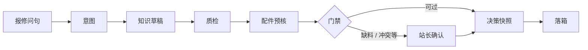
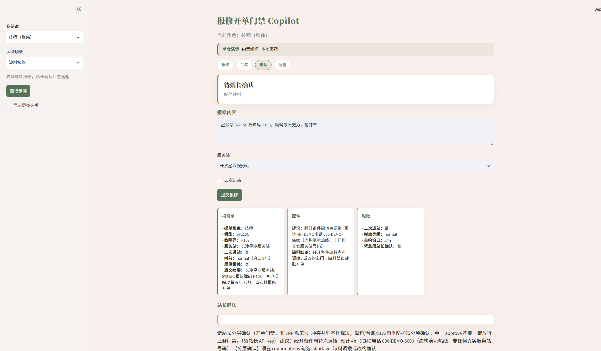
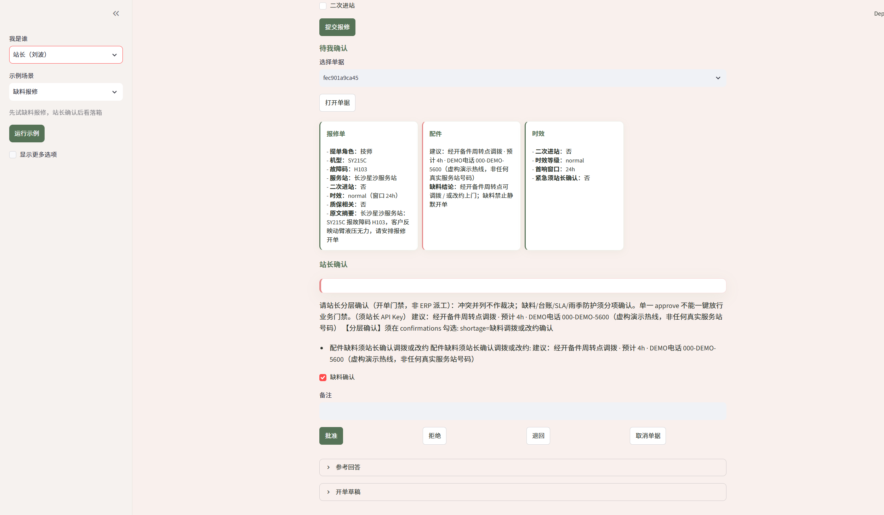
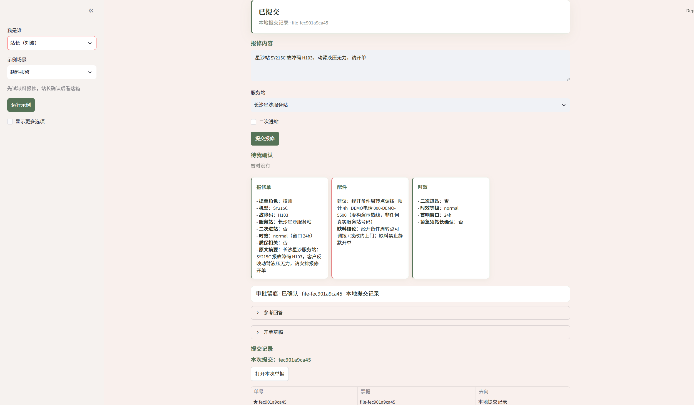

# 工程机械售后 · 报修开单门禁 Copilot

[](LICENSE)
[](requirements.txt)
[](.github/workflows/ci.yml)

报修开单前要解决的是：谁可以提交、缺料或制度冲突要不要拦、提交记在谁名下。本仓库做这件事——门禁编排与站长确认。

检索和生成在姊妹仓 `enterprise-rag`（售后知识治理 Copilot）。本仓默认单仓可跑：本地 Fixture 知识源 + `file_outbox`，不必先起姊妹仓。接上真知识仓或契约桩属于联调加分。

个人求职项目（linnea，2026-08）。仓库：https://github.com/Linneaovo/aftersales-ticket-gate  
产品英文名 *After-Sales Ticket Gate Copilot*；本地目录仍可能是历史名 `aftersales-dispatch-copilot`。落箱一律 `is_production_ticket=false`。

相关文档：[双仓](docs/DUAL_REPO.md) · [范围](docs/STANDALONE_SCOPE.md) · [边界](docs/BOUNDARY.md) · [演示](DEMO_SCRIPT.md) · [架构](ARCHITECTURE.md) · [契约](docs/RAG_COPILOT_CONTRACT.md)

## 做什么 / 不做什么

| 做 | 不做 |
|----|------|
| 规则意图、策略门禁、配件预核、站长确认、决策快照、可插拔落箱 | ERP 派工、真 WMS/SSO、仓内向量检索或调 LLM |
| 改台账库存即可对照缺料门禁是否触发（剧本 P1 / P1b） | 用制度冲突替站长做裁决 |
| 单仓自立；联调分 L1（契约桩）与 L2（真模型） | 把离线测试或契约桩说成真模型联调 |

决策快照记录策略版本与确认项，方便回放；不是防篡改审计系统。Streamlit（`:8502`）是联调/演示台，不是站长作业端。

## 主流程

约 6 分钟可走通：缺料问句 → 待站长确认 → 批准 → Outbox（单仓）或 RAG mock inbox（联调）。



| | |
|--|--|
|  | 缺料 → 待站长确认 |
|  | 站长勾选确认后批准 |
|  | 审批留痕与提交记录 |

复拍截图：`python scripts/capture_demo_screenshots.py`（需 `:8002` + `:8502`）。步骤见 [DEMO_SCRIPT.md](DEMO_SCRIPT.md)。

## 技术栈与规模

FastAPI · LangGraph（SQLite checkpoint）· Pydantic v2 · Streamlit · httpx · pytest · Docker Compose · GitHub Actions

| 项 | 数量 / 版本 |
|----|-------------|
| 剧本 | 12（`data/playbooks/`） |
| 主路径策略 | 5（`CORE_POLICIES`，目录版 `2026-08-28.opt2`） |
| 测试模块 | 43 × `tests/test_*.py` |
| 消费方契约 | `2026-08-29.1`（须与 RAG `/health.consumer_contract_version_supported` 一致） |
| pytest 收集数 | 见 `app/eval/ssot.py`（文档不写死） |

检索 MRR 等指标在姊妹仓，不在本仓宣称。

## 环境

- Python 3.11+（建议与 CI 一致）
- Windows 可用根目录 `*.cmd`；其他平台用下方命令

```text
python -m venv .venv
.\.venv\Scripts\activate          # Linux/macOS: source .venv/bin/activate
pip install -r requirements.txt
copy .env.standalone .env         # Linux/macOS: cp .env.standalone .env
```

## 快速开始

| 入口 | 用途 |
|------|------|
| `start_standalone.cmd` | 单仓：Fixture + `file_outbox`，UI `:8502` |
| `run_l1_linkage.cmd` | L1 契约联调（Compose 桩，无 GPU） |
| `start_copilot_live.cmd` / `.env.demo` | 仅起本仓联调配置；真 RAG 需另启 `:8001` |
| `run_responsibility_chain.cmd` | 双服务已就绪时的责任链与证据包 |

### 单仓

```text
copy .env.standalone .env
start_standalone.cmd
curl http://127.0.0.1:8002/health
```

应看到 `runtime_mode=standalone`、`submit_destination=file_outbox`、`linkage_claim=none`。脚本会 reset、等健康检查并跑 preflight；失败则不启 UI。改代码后请重启 `:8002`。

手动：

```text
uvicorn app.main:app --host 127.0.0.1 --port 8002
streamlit run app/ui/streamlit_app.py --server.port 8502
```

状态异常时：

```text
python scripts/reset_demo_state.py
python scripts/demo_preflight.py --standalone
```

### 离线测试（L0）

本地有演示用 `.env` 也可以直接测：`tests/conftest.py` 会隔离成离线套件形态。

```bash
python -m pytest -q -m "not integration"
```

OpenAPI：http://127.0.0.1:8002/docs · UI：http://127.0.0.1:8502

### L1 契约联调

证明 HTTP 契约与提交归属，不证明检索质量。

```bash
docker compose -f docker-compose.joint.yml up --build -d
docker compose -f docker-compose.joint.yml exec api python scripts/reset_demo_state.py
docker compose -f docker-compose.joint.yml exec api python scripts/run_l1_linkage.py
```

产物：`data/eval/l1_linkage_report.json`（`l1_verified=true`，`live_verified=false`）。此时 `/health.linkage_claim` 多为 `L1`。

### L2 真模型联调（可选）

需本机 `enterprise-rag` 在 `:8001` 健康（含嵌入与生成模型），契约版本一致。

```text
copy .env.demo .env
python scripts/demo_preflight.py --require-rag --smoke-run --contract
python scripts/build_joint_evidence_pack.py --live
```

只有联合包 `evidence_tier=L2` 且 `live_verified=true` 才算真联调通过。真 RAG 下 `/health.linkage_claim` 常见为 `http_live`（表示 HTTP 已通），**不要**把它当成 L2 标签；L2 看联合包字段。

## 验证分层

| 层 | 能证明什么 | 怎么跑 |
|----|------------|--------|
| L0 | 离线门禁回归 | `ci.yml` / pytest |
| Standalone | 无 `:8001` 时本仓可跑通 | `demo_preflight.py --standalone` |
| L1 | 契约与提交归属 | `linkage-l1.yml` · `docker-compose.joint.yml` |
| L2 | 真 RAG + 模型路径 | 本机 · `live-linkage.yml`（默认关） |

字段约定见 `app/eval/evidence_tier.py`。历史快照或 `--from-artifacts` 不是 L2。

## 场景与主策略

星沙 H103：SY215C 动臂无力 → 草稿与配件预核 → 推荐件库存为 0 时触发缺料确认（POL-PARTS-01）。触发点是缺料，不是故障码表直触。

| 策略 | 作用 |
|------|------|
| `POL-ROLE-01` | 非站长不能直接提交 |
| `POL-CONFLICT-01` | 质保/制度冲突并列展示，站长确认 |
| `POL-PARTS-01` | 缺料须确认调拨或改约 |
| `POL-SLA-01` | 时效窗口写入快照，供确认时对照 |
| `POL-DEGRADE-01` | 知识源降级时收紧自动路径 |

完整目录：`GET /policies` · `app/policy/rules_catalog.py`。

## 使用与局限

- 演示用 API Key：写路径须带 Header / body / 剧本内嵌；省略返回 401。
- 配件台账为 JSON（可改 stock）；可选本地 mock WMS。
- `/health` 里 `live_eval_artifacts_ok` 读仓内 JSON；`live_eval_all_ok` 仅当场 HTTP live 时为 true。

## 作者

linnea · 2026-08 · [MIT](LICENSE)
