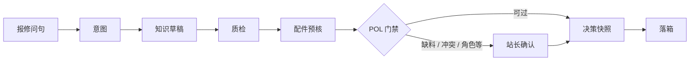

# 工程机械售后 · 报修开单门禁 Copilot

[](LICENSE)
[](requirements.txt)
[](.github/workflows/ci.yml)

售后报修里，知识侧可以先给出带证据的草稿；真正麻烦的是开单前：谁能提交、缺料或制度冲突要不要拦、提交记在谁名下。本仓做这件事——开单门禁编排，不是 ERP 派工，也不在仓内做向量检索或调 LLM。

检索 / 生成在姊妹仓（产品名：售后知识治理 Copilot，本地目录 `enterprise-rag`）。本仓默认 Standalone：Fixture 假知识源 + 本仓 `file_outbox`，clone 下来就能跑，不必先起姊妹仓。L1 / L2 联调是加分项。

个人求职项目（作者 linnea，2026-08）。我主要写了 LangGraph 编排、五条 POL 门禁、站长确认（HITL）、配件预核反证，以及 L0/L1/L2 证据分层和 CI。

产品英文名 *After-Sales Ticket Gate Copilot*；本地目录可能仍是历史名 `aftersales-dispatch-copilot`，建议 GitHub 名 `aftersales-ticket-gate`。落箱一律 `is_production_ticket=false`。

文档：[双仓](docs/DUAL_REPO.md) · [说明](docs/OVERVIEW.md) · [自立范围](docs/STANDALONE_SCOPE.md) · [演示](DEMO_SCRIPT.md) · [架构](ARCHITECTURE.md) · [契约](docs/RAG_COPILOT_CONTRACT.md)

## 设计取舍

- 改 JSON 配件台账的 stock，缺料门禁（POL-PARTS）触发 / 不触发可以对着演（剧本 P1 / P1b）。
- Standalone 不依赖 `:8001`；L1 只证 HTTP 契约；只有 L2 才标 `live_verified`，避免把假联调说成 Live。
- 质保冲突只并列展示，系统不替站长裁决；Decision Snapshot（决策快照）记下策略版本和确认层，不是防篡改审计中台。

## 演示路径

约 6 分钟：缺料问句 → 待站长确认 → 批准 → Outbox。口播见 [DEMO_SCRIPT.md](DEMO_SCRIPT.md)。



| | |
|--|--|
|  | 缺料 → 待站长确认 |
|  | 站长勾选缺料确认后批准 |
|  | 审批留痕与提交记录 |

复拍：`python scripts/capture_demo_screenshots.py`（需 `:8002` + `:8502`）。

## 技术栈

FastAPI · LangGraph（含 SQLite checkpoint）· Pydantic v2 · Streamlit · httpx · pytest · Docker Compose · GitHub Actions

## 目录

- [设计取舍](#设计取舍)
- [演示路径](#演示路径)
- [技术栈](#技术栈)
- [仓库规模](#仓库规模)
- [主流程](#主流程)
- [职责边界](#职责边界)
- [环境要求](#环境要求)
- [快速开始](#快速开始)
- [验证分层](#验证分层)
- [场景与策略](#场景与策略)
- [范围与局限](#范围与局限)
- [作者](#作者)

## 仓库规模

产品侧：

| 项 | 数 | 出处 |
|----|----|------|
| 剧本 | 12 | `data/playbooks/` |
| 主路径策略 | 5 | `CORE_POLICIES` · 目录版 `2026-08-28.opt2` |
| 测试模块 | 42 × `tests/test_*.py` | 仓库 |

工程侧：

| 项 | 数 | 出处 |
|----|----|------|
| 消费方契约 | `2026-08-29.1` | `app/tools/rag_contract.py` |
| L1 联调产物 | `l1_verified=true` 且 `live_verified=false` | `data/eval/l1_linkage_report.json` · `linkage-l1.yml` |
| pytest collect | 见 `PYTEST_*_COLLECT` | [`app/eval/ssot.py`](app/eval/ssot.py)（文档不写死数字） |

以上是门禁与契约规模，不是检索 MRR；检索指标在姊妹仓。

## 主流程

站长确认即 HITL；决策快照记录策略版本与确认层。Standalone 落本仓 `file_outbox`；联调可落 RAG `rag_mock_inbox`。主引擎 LangGraph，fallback 只做异常容灾。Streamlit `:8502` 是联调台，不是站长作业端。

## 职责边界

| | 本仓 | `enterprise-rag`（可选） |
|--|------|--------------------------|
| 角色 | 行动层：门禁 / 人确 / 快照 / submit | 知识层：检索 / 生成 / ACL / 冲突并列 |
| Standalone | Fixture + `file_outbox`，无需姊妹仓 | 不需要 |
| 联调 | HTTP 消费 `:8001` | 提供 ask / draft / inbox |

契约须对齐：本仓 `CONTRACT_VERSION` 与 RAG `/health.consumer_contract_version_supported` 同为 `2026-08-29.1`。

## 环境要求

- Python 3.11+（建议与 CI 一致）
- Windows 可用根目录 `*.cmd`；Linux / macOS 用下方 `python` / `docker compose`
- 依赖：`pip install -r requirements.txt`（`start_standalone.cmd` 会建 `.venv` 并安装）

```text
python -m venv .venv
.\.venv\Scripts\activate          # Linux/macOS: source .venv/bin/activate
pip install -r requirements.txt
copy .env.standalone .env         # Linux/macOS: cp .env.standalone .env
```

## 快速开始

第一次建议只跑 Standalone：无 GPU、不依赖 `enterprise-rag`。

| 入口 | 用途 |
|------|------|
| `start_standalone.cmd` | Fixture + `file_outbox`，无需 `:8001`；UI `:8502` |
| `run_l1_linkage.cmd` / 下方 Compose | L1 契约联调（无 GPU，与默认 CI 同路径） |
| `start_all.cmd` | L2：需本机真 RAG `:8001`（含模型）已就绪 |
| `start_copilot_live.cmd` | 仅起 Copilot（`.env.demo`），RAG 另启 |
| `run_responsibility_chain.cmd` | 责任链 + 证据包（双服务已就绪） |

### Standalone

```text
copy .env.standalone .env
start_standalone.cmd
curl http://127.0.0.1:8002/health
```

任意平台（venv 已激活）：

```text
cp .env.standalone .env   # Windows: copy
uvicorn app.main:app --host 127.0.0.1 --port 8002
# 另开终端：streamlit run app/ui/streamlit_app.py --server.port 8502
```

状态异常（`persistence_ok=false`，或刚改过代码）时：

```text
python scripts/reset_demo_state.py
python scripts/demo_preflight.py --standalone
```

`start_standalone.cmd` 已含 reset。以 preflight 为准，勿只看 `/health.status`。改代码后重启 `:8002`，否则 `/health.version` 与源码不一致会导致 preflight 失败。

```bash
python -m pytest -q
```

可选 Docker：

```bash
docker compose up --build -d
docker compose exec api python scripts/reset_demo_state.py
docker compose exec api python scripts/demo_preflight.py --standalone
```

OpenAPI：http://127.0.0.1:8002/docs · UI：http://127.0.0.1:8502

### L1 契约联调

证 HTTP 契约与 submit 归属，不证检索质量。

```bash
docker compose -f docker-compose.joint.yml up --build -d
docker compose -f docker-compose.joint.yml exec api python scripts/reset_demo_state.py
docker compose -f docker-compose.joint.yml exec api python scripts/run_l1_linkage.py
```

产物：`data/eval/l1_linkage_report.json`（`evidence_tier=L1`，`l1_verified=true`，`live_verified=false`）。

### L2 联调（可选）

需本机 `enterprise-rag` 已在 `:8001` 健康（含模型），且契约版本一致。

```text
copy .env.demo .env
python scripts/demo_preflight.py --require-rag --smoke-run --contract
python scripts/build_joint_evidence_pack.py --live
```

联合包为 `evidence_tier=L2` 且 `live_verified=true` 时，才算真联调通过。以 `/health.runtime_mode` 区分 Standalone 与联调。

## 验证分层

日常看 Standalone 与 L1；接上真知识仓后再看 L2。

| 层 | 可证明 | 入口 |
|----|--------|------|
| L0 | 离线门禁回归 | `ci.yml` / pytest |
| Standalone | 无 `:8001` 时本仓可独立跑通 | `demo_preflight.py --standalone` |
| L1 | HTTP 契约与提交归属 | `linkage-l1.yml` · `docker-compose.joint.yml` |
| L2 | 真 RAG + 模型路径 | 本机 / `live-linkage.yml`（默认关闭） |

分层字段不要混用，约定见 `app/eval/evidence_tier.py`。`--from-artifacts` → `artifacts`（非 L2）；L1 下 `rag_mode=live` 只表示 HTTP 可达，≠ `live_verified`。

## 场景与策略

星沙 H103：SY215C 动臂无力 → 草稿 / 质检 / 配件预核 → 推荐件库存为 0 时走 POL-PARTS-01 进站长确认。触发条件是缺料，不是故障码表直触。步骤见 [DEMO_SCRIPT.md](DEMO_SCRIPT.md)。

五条主策略（`CORE_POLICIES`，版 `2026-08-28.opt2`）：

| 策略 | 作用 |
|------|------|
| `POL-ROLE-01` | 非站长不能直接 submit |
| `POL-CONFLICT-01` | 质保/制度冲突并列展示，站长确认，系统不裁决 |
| `POL-PARTS-01` | 缺料必须人确调拨或改约，禁止静默当有货开单 |
| `POL-SLA-01` | 时效窗口进入快照，供确认时对照 |
| `POL-DEGRADE-01` | 知识源降级时收紧自动路径，避免不完整或降级结果直接落箱 |

完整文案与指纹：`app/policy/rules_catalog.py`。

## 范围与局限

- 使用：演示 API Key、`file_outbox` / mock inbox、JSON 配件台账、规则意图、Streamlit 联调台。
- 不做：仓内 LLM / Multi-Agent 自主开单、生产 ERP/WMS/SSO、把 L0/L1 或历史快照说成 L2 Live。

## 作者

linnea · 2026-08 · [MIT](LICENSE)
